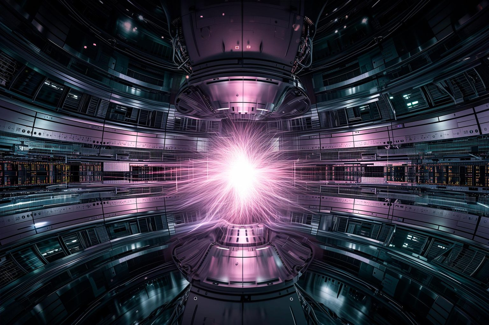

{align=center  width="900"}

###
The Heterogeneous Exascale PIC (HEXAPIC)

!!! note ""

    **
HEXAPIC progress beyond the state-of-the-art - HPC
**
    
##<u>Hypothesis:</u>

 - H1: Modern heterogeneous computer architectures offer a possibility for improved 
architectures of particle-in cell codes based on optimised algorithms for a description of 
physical mechanisms, optimal division of workload, use of accelerators, optimised 
communication and memory management leading to a significant improvement in code 
performance.
 - H2: Fully-kinetic PIC codes for modelling plasma technological processes are needed to 
improve our predictive and optimising capabilities. An improved particle-in-cell code, based 
on state-of-the-art and beyond optimisation, would allow realistic geometries and inclusion of 
all relevant plasma processes in plasma simulations and offer the highest degree of precision 
and rigour in plasma description.

     
##<u>Objectives:</u>

 - O1: Propose a new PIC code architecture based on heterogeneous architectures of modern 
high-performance computers, which can be efficiently extended into exascale.
 - O2: Formalise a PIC code capable of exascale performance, which is used to create realistic 
plasma simulations in terms of geometry and description of processes in plasma.

##<u>Contributions:</u>
 - C1: A novel PIC code capable of exascale performance based on an adaptable 
heterogeneous architecture with optimised memory management and workload splitting. 
 - C2: Use cases showing the capability of the novel PIC code to provide realistic simulations of 
plasma, including complexities in geometry and plasma collisional and transport processes 
resulting in new physics insights.

